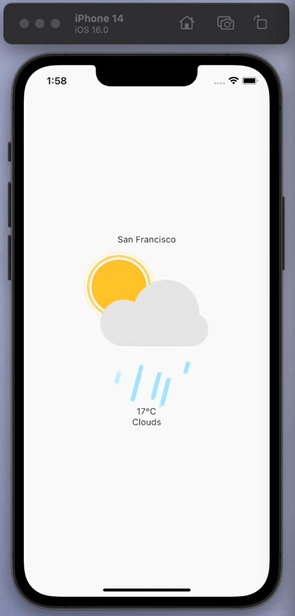

# Flutter Weather App

This is a minimalistic Flutter app that shows the weather in your location.




## Getting Started

These instructions will get you a copy of the project up and running on your local machine for development and testing purposes.

### Prerequisites

Before you can run this project, you will need the following:

- Flutter SDK
- Dart SDK
- An IDE (like Android Studio or VS Code) with Flutter plugin installed

You can download Flutter SDK from [here](https://flutter.dev/docs/get-started/install) and Dart SDK is bundled with it. Follow the instructions on the Flutter website to install and setup your IDE.

### Installing

1. Clone this repository
2. Open the project with your IDE
3. Get the packages by running `flutter pub get` in the terminal
4. Insert your API key in /lib/pages/weatherpage.dart
5. Run the app using `flutter run`

## Running the tests

To run the tests in this project, use the following command in the terminal:
```
flutter test
```

## Deployment

To build an APK for deployment, use the following command:
```
flutter build apk
```

This will generate an APK file in the `build/app/outputs/flutter-apk/` directory in your project.

## Built With

- [Flutter](https://flutter.dev/) - The UI framework used
- [Dart](https://dart.dev/) - The language used
